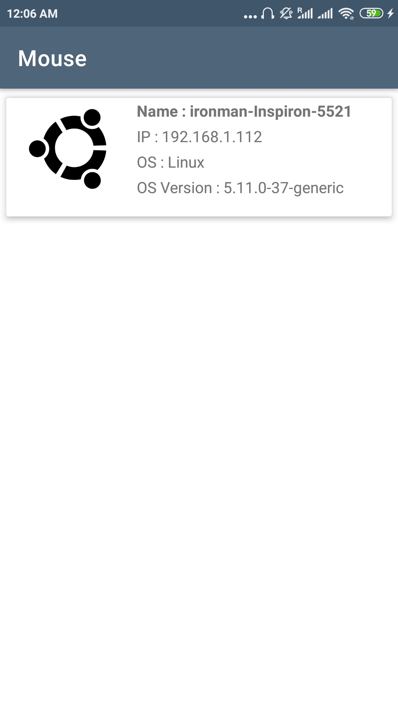
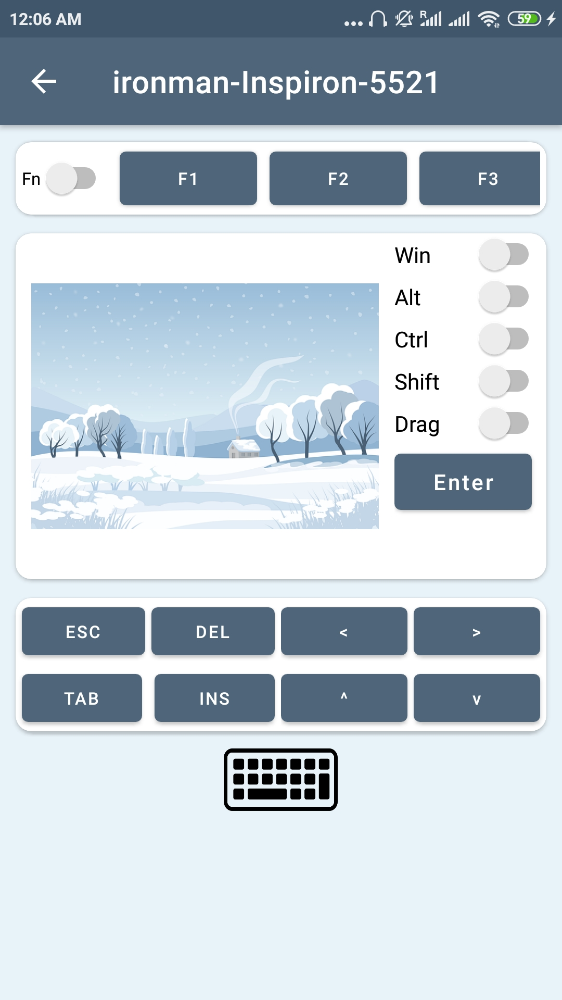

# Mouse App

This is an Android app that enables users to control their computers' cursor and keyboard from their phones. 

## How to use :
1. Install the Android application on the Android phone.
1. Install the desktop app on the computer.
1. Ensure that the Android phone and the desktop are connected to the same network. (Same WiFi)
1. The desktop information will be displayed on the app. Select the appropriate option on the phone.   
1. Control the computer from the phone using the keyboard keys and the touchpad.   
